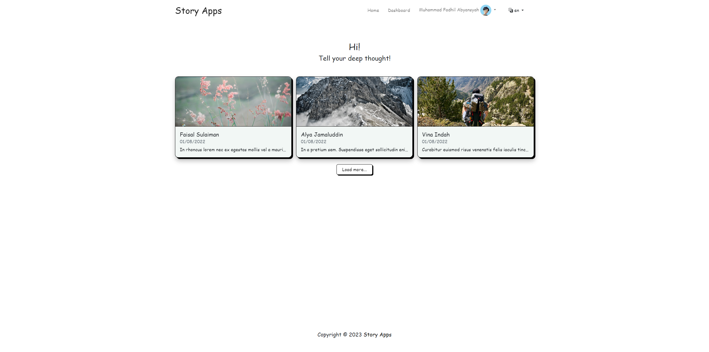
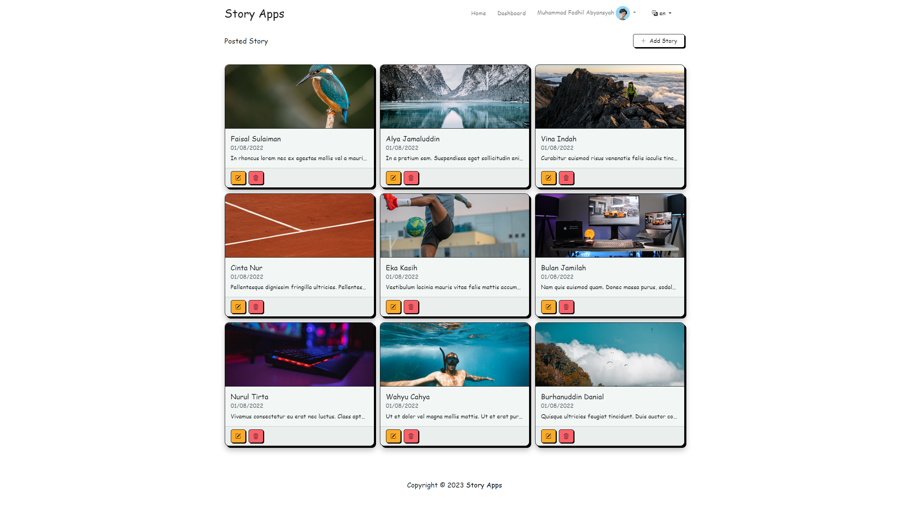
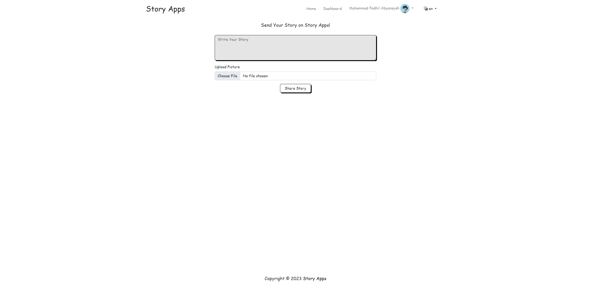
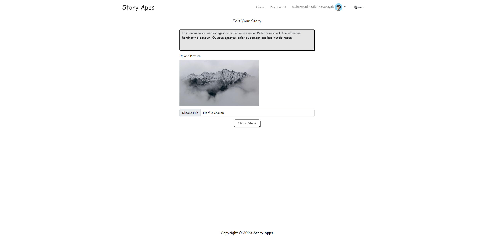

# Story App
Submission: Proyek Pertama pada kelas Belajar Tools Front-End Web Intermediate

## Run Locally
Clone the project
```bash
  git clone https://github.com/takasicode/story-app
```

Go to the project directory
```bash
  cd takasicode/story-app
```

Install dependencies

```bash
  npm install
```

Start the server

```bash
  npm run dev
```

## Rating Submission
⭐⭐⭐⭐⭐

## Screenshot
Home Page


Dashboard Page


Add Story Page


Edit Story Page


## Tech Stack
[](https://github.com/takasicode/story-app)
